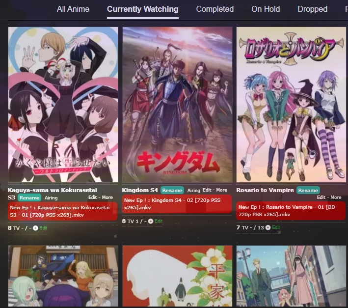

### Introduction
This script applies to your MAL CURRENTLY WATCHING page and show a link of next episode of your last seen episode in front of each anime.

### How to config for the first time

1) Install the script ([from here](https://greasyfork.org/en/scripts/435555-telegram-new-episode-finder-for-mal-watching-list-page)) or create it manualy from Tempermonkey dashboard.

2) A prompt requests for phone number. Enter your phone number with country code. 

3) Enter received verification code.

4) A prompt requests for peer id. Enter your search target peer id. You can find it by forward it's message to `@username_to_id_bot`. The using telegram user most has access to this peer.

** If your anime name differs from Mal anime title click rename and enter exact name from your telegram peer.

