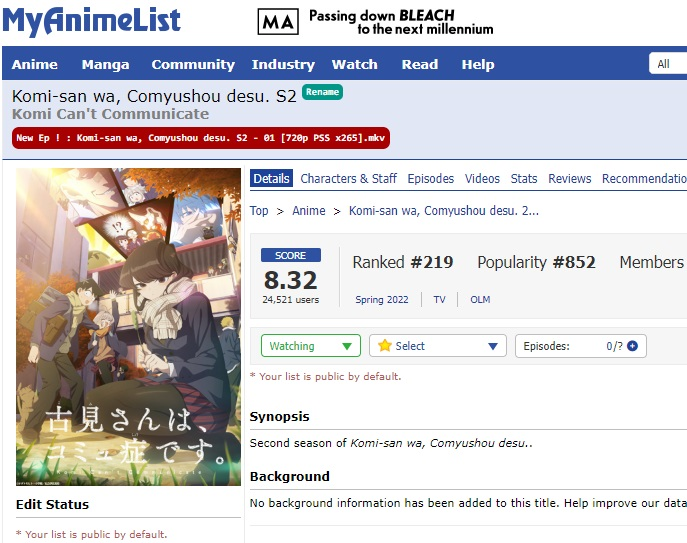

 

### Introduction

This script applies to MAL anime page and watching list page. It finds next episode from telegram configured channels and groups and show link of found file (telegram link) in front of each anime title.

### How to setup

1) Install the script ([from here](https://greasyfork.org/en/scripts/436807-telegram-new-episode-finder-for-mal-watching-list-page-and-anime-list)) or create it manualy from Tempermonkey dashboard from `IntegratedScript.js` file.

2) A prompt requests for phone number. Enter your phone number with country code. 

3) Enter verification code.

4) A prompt requests for peer id. Enter your search target peer id. You can find it by forwarding a message to `@username_to_id_bot`. Add multipe peerIds seprated by comma `,`. Telegram account must joined or has access to these peers.

** If your anime name differs from Mal anime title click rename and enter exact name from your telegram peer.
